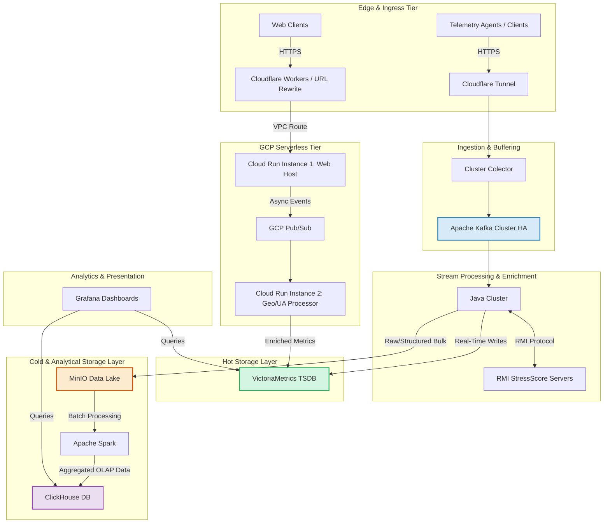

# WebHardMon: Distributed Hardware Telemetry and Processing System

**Comprehensive System Architecture & Design Context Documentation**

| Field | Value |
|---|---|
| **Author** | Iker Berrozpe Echeverria |
| **Institution** | Mondragon Unibertsitatea |
| **Date** | May 2026 |

> [!IMPORTANT]
> This document serves as the **absolute source of truth** and architectural context for the WebHardMon project. It details the end-to-end distributed infrastructure, ingestion pathways, processing tiers, storage layers, and operational design decisions. Use this markdown file as a context injection layer for future engineering, development, and infrastructure-as-code tasks.

---

## 1. System Overview & Architecture Diagram

WebHardMon is a **hybrid, distributed, high-availability system** engineered for hardware telemetry ingestion, real-time stress scoring, serverless event collection, and multi-tier analytical processing.

The system divides data management into **three processing lanes**:

| Lane | Description |
|---|---|
| 🔴 **Hot Path** | Low-latency stream processing for real-time monitoring and alert triggering |
| 🔵 **Cold / Analytical Path** | High-throughput batch processing for deep statistical analysis and historical storage |
| 🟢 **Serverless Edge Path** | Scale-to-zero public-facing ingestion layer capturing web metrics and geolocation metadata |

### 1.1 Architecture Diagram



---

## 2. Detailed Component Breakdown

### 2.1 Ingress & Edge Tier

- **Cloudflare Tunnel (CF Tunnel):** Establishes a secure, encrypted outbound-only connection from the on-premise infrastructure to the Cloudflare edge. It eliminates the need for public inbound ports, shielding the internal architecture from DDoS vectors.

- **Cloudflare Workers:** Executed at the edge to perform lightweight request routing and URL rewriting dynamically before reaching the application services.

### 2.2 Ingestion & Buffering Tier

- **Cluster Colector:** Edge-facing ingest service specialized in parsing, validating, and throttling high-frequency hardware metrics payloads sent over HTTPS.

- **Apache Kafka (High Availability Cluster):** Acts as the central event backplane. Configured with a multi-broker layout ensuring fault-tolerance and partition durability. It decouples the unstable, bursty ingress metrics from the downstream processing application engines.

### 2.3 Processing & Enrichment Tier

- **Java Cluster:** A master-less/distributed hybrid clustering framework implemented in Java. It acts as the core stream consumer from Apache Kafka.

- **RMI (Remote Method Invocation) Servers:** Independent, horizontally-scalable calculation engines. The Java Cluster interfaces with these servers via RMI to compute the proprietary **StressScore** metric in real-time. This structural isolation separates business calculation logic from stream orchestration logic.

### 2.4 Storage Layers

- **VictoriaMetrics (VM):** The dedicated primary time-series database (TSDB). Chosen for its extreme compression algorithms, ultra-low memory footprint, and native compatibility with Prometheus querying structures. It stores both real-time streams from the Java Cluster and processed web metrics from GCP Cloud Run.

- **MinIO Object Storage:** Functions as the project's self-hosted Data Lake. Telemetry records are preserved in optimized file formats (such as Apache Parquet or Avro) to allow efficient cold data analytics.

- **ClickHouse:** The columnar open-source Online Analytical Processing (OLAP) database. It is populated via batch workflows and handles ultra-fast, massive, multi-dimensional analytical queries across historical metrics.

### 2.5 Serverless Analytics (GCP)

- **Cloud Run Instance 1 (Web Host):** The public web surface hosting front-end components and customer portals. Every interaction, audit log, or tracking metric triggers an asynchronous message publication event.

- **GCP Pub/Sub:** An enterprise-scale, fully managed asynchronous messaging middleware used to orchestrate serverless event patterns without blocking the UI thread.

- **Cloud Run Instance 2 (Geo/UA Processor):** A specialized processing container triggered by Pub/Sub event subscriptions. It parses incoming event payloads, conducts User-Agent string analysis, executes IP-to-Geolocation lookups, and outputs the resulting telemetry vectors straight into the centralized VictoriaMetrics core.

### 2.6 Visualization Layer

- **Grafana:** The single pane of glass for systems observability. Configured with dual data sources to query VictoriaMetrics for high-velocity real-time graphing/alerting, and ClickHouse for long-term historical slice-and-dice telemetry summaries.

---

## 3. End-to-End Data Lifecycle & Execution Flows

### 3.1 Flow A: Core Hardware Telemetry (Stream & Batch Analytics)

```
Emit → Ingress → Queue → Consume & Enrich → [Hot Path | Cold Path] → Batch Transformation
```

1. **Emit:** Target servers/devices post JSON telemetry payloads containing low-level hardware states (CPU, thermals, RAM, disk I/O) over HTTPS.
2. **Ingress:** The traffic crosses the Cloudflare Tunnel and is collected by the Cluster Colector.
3. **Queue:** The Collector writes events immediately into specific topics within the Kafka HA Cluster.
4. **Consume & Enrich:** The Java Cluster pulls batches from Kafka, triggers a blocking/non-blocking RPC network call to the RMI Servers to compute the StressScore, and binds the score back to the tracking metadata object.
5. **Branch — Hot Path:** The enriched object is written directly to VictoriaMetrics (latency < 50ms). Grafana updates live dashboards.
6. **Branch — Cold Path:** Concurrently, the Java Cluster batches raw/semi-structured metrics to MinIO Object Storage.
7. **Batch Transformation:** At configured intervals, Apache Spark jobs pull raw historical blocks from MinIO, optimize data structures, aggregate metrics over time blocks, and pipe the dataset into ClickHouse column-families for analytical persistence.

### 3.2 Flow B: Web Traffic & Cloud Ingestion Path

```
User Request → Edge Route → Ingest Web Event → Serverless Execution → Metadata Enrichment → Consolidation
```

1. **User Request:** A web user hits the application ecosystem.
2. **Edge Route:** Cloudflare Workers capture the request, apply rewrite transformations, and forward it securely into GCP via private VPC routing.
3. **Ingest Web Event:** Cloud Run Instance 1 (Web Host) serves the application traffic and publishes a descriptive interaction event payload to GCP Pub/Sub.
4. **Serverless Execution:** GCP Pub/Sub instantiates/triggers Cloud Run Instance 2 (Processor).
5. **Metadata Enrichment:** Instance 2 parses the network packet, breaks down the Browser User-Agent string, tracks the geographical region using MaxMind or Google IP databases, and formats the output into standard time-series data points.
6. **Consolidation:** The serverless instance establishes a secure pipeline into the central infrastructure and writes the web tracking telemetry into VictoriaMetrics, unifying user metrics with backend hardware behavior.

---

## 4. Architectural Decision Records (ADRs)

### 4.1 Storage Selection: MinIO Selected Over Ceph / Hadoop

| | |
|---|---|
| **Decision** | Implement MinIO as the foundational object storage engine |
| **Rejected alternatives** | Ceph, HDFS / Hadoop ecosystem |

**Justification:** Implementing Ceph or an HDFS Hadoop ecosystem presents immense operational complexity and maintenance overhead that is non-justifiable for the current scope and velocity of WebHardMon. MinIO offers seamless cloud-native S3-API compatibility, high-performance read/write parameters for large object blocks (Parquet/Avro), and blends perfectly into the Spark processing framework.

---

### 4.2 Analytical Database Selection: ClickHouse Selected Over Apache Cassandra

| | |
|---|---|
| **Decision** | ClickHouse selected for historical analytics |
| **Rejected alternative** | Apache Cassandra (explicitly rejected) |

**Justification:** Cassandra requires rigid query modeling based on primary keys, making ad-hoc data analysis and multi-dimensional aggregations extremely difficult and performatively expensive. ClickHouse, as a pure columnar OLAP database, delivers superior compression ratios and executes heavy, complex SQL aggregation algorithms across billions of telemetry rows orders of magnitude faster.

---

### 4.3 Monitoring Core Selection: VictoriaMetrics

| | |
|---|---|
| **Decision** | Deploy VictoriaMetrics as the high-velocity operational TSDB |
| **Rejected alternatives** | Standard Prometheus storage, InfluxDB |

**Justification:** VictoriaMetrics replaces traditional alternatives by offering superior memory management, high-performance vertical/horizontal scaling traits, and exceptional disk write efficiencies when storing high-cardinality data coming out of distributed Java application nodes.

---

## 5. Deployment & Operational Engineering Notes

### 5.1 Infrastructure-as-Code (IaC) & Provisioning Race Conditions

> [!WARNING]
> **Race Condition Risk:** During automated deployment sequences (orchestrated via OpenTofu/Terraform and Ansible), specific race conditions occur between the provisioning of stateful infrastructure clusters (e.g., Kafka HA, VictoriaMetrics, ClickHouse) and stateless execution targets (e.g., the Java Cluster or Collector microservices).

> [!CAUTION]
> **Required Fix:** To ensure structural stability and guarantee that dependent database and streaming ports are completely bound and healthy before ingestion microservices attempt initialization, any `apply` command or initialization script **must embed an explicit 45-second sleep interval** (`sleep 45`) post-infrastructure deployment. This avoids premature health-check crashes and prevents cascading container crash-loops during environment bootstrapping.

```bash
# Required pause after infrastructure provisioning
sleep 45
```